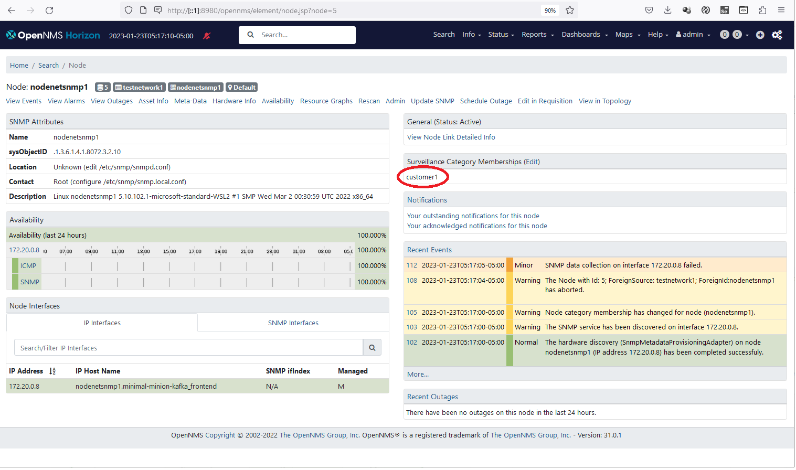
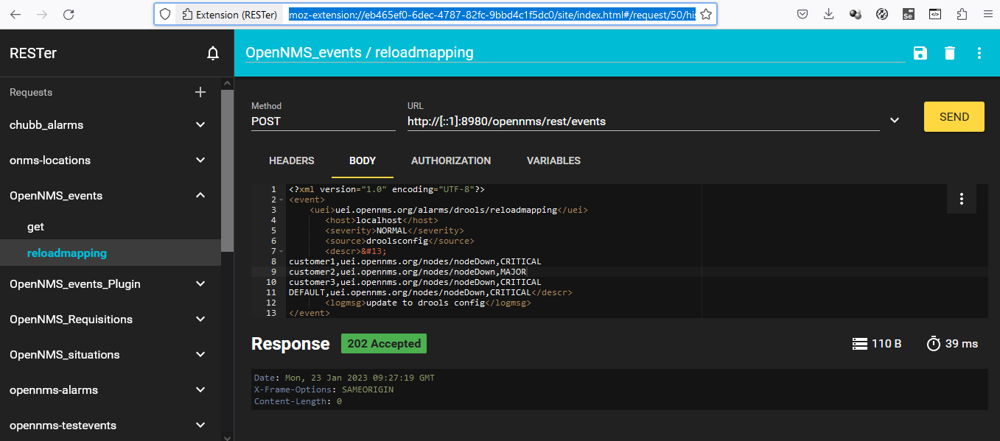
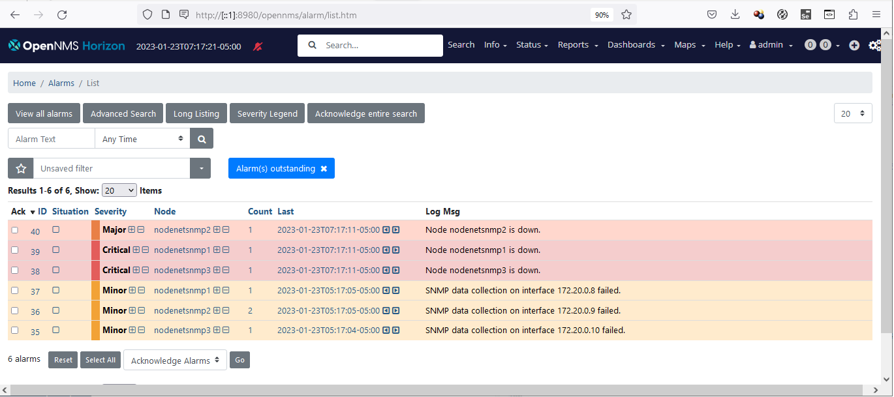

# Using Drools rules to change severity of alarms

## introduction
In this example we look at how the in built drools rete engine can be use o change the severity of reported alarms depending on the criteria of the node reporting the alarm.

The use case for this configuration is as follows. 
An MSP uses OpenNMS to manage a number of accounts. 
Each account has their own OpenNNS instance which has custom configurations to set the priority given to alarms reported by that account. The alarm severity is presently determined by changing the severity of the modified alarms in the file 

[-opennms-home-/etc/eventconf.xml](../minimal-minion-kafka/container-fs/horizon/opt/opennms-overlay/etc/eventconf.xml)

and the folder

[-opennms-home-/etc/events](../minimal-minion-kafka/container-fs/horizon/opt/opennms-overlay/etc/events) 

This requires the user to track copies of multiple configurations and it is difficult to upgrade all of the customers systems as each needs careful attention to the etc upgrade.

The user wishes to reduce the number of OpenNMS instances and replace them with per-customer minions.  
They also want ot make it easier to apply customer severities to alarms reported for each customer.

In this solution we provide the following features

1. we provide a severity configuration file, rules-constants.csv
This changes the severity only for alarms on nodes with a corresponding surveillence category.

[-opennms-home-/etc/alarmd/rules-constants.csv](../minimal-minion-kafka/container-fs/horizon/opt/opennms-overlay/etc/alarmd/rules-constants.csv)

This file carries a comma separated list of 'node surveillance category, alarm uei, new severity'

```
customer1,uei.opennms.org/nodes/nodeDown,MAJOR
customer2,uei.opennms.org/nodes/nodeDown,CRITICAL
customer3,uei.opennms.org/nodes/nodeDown,NORMAL
DEFAULT,uei.opennms.org/nodes/nodeDown,WARN

```

The new severity must be in capitals and can be INDETERMINATE, CLEARED, NORMAL, WARNING, MINOR, MAJOR, CRITICAL (as per the OnmsSeverity enum). 
This determines the severity which will be given to the alarm regardless of the severity assigned in the event configuration.

The UEI is the <uei> field for the alarm definition where you want to override the severity

The category corresponds to a node surveillance category which can be seen and set on the node page and in requisitions.
In this case we have given a category to a node corresponding to a customer name



Note that the DEFAULT category is reserved. 
Any alarm with a DEFAULT mapping will always have it's severity changed regardless of the node category. 
This allows a generalised default mapping to be applied to all alarms.
If a specific category is also defined for the URI, the DEFAULT mapping will be overwritten.

An example requisition with categories is here

[-opennms-home-/etc/imports/testnetwork1.xml](../minimal-minion-kafka/container-fs/horizon/opt/opennms-overlay/etc/imports/testnetwork1.xml)

```
<model-import xmlns="http://xmlns.opennms.org/xsd/config/model-import" date-stamp="2023-01-20T06:19:53.674-05:00" foreign-source="testnetwork1" last-import="2023-01-20T06:23:50.388-05:00">
   <node foreign-id="nodenetsnmp2" node-label="nodenetsnmp2">
      <interface ip-addr="172.20.0.9" status="1" snmp-primary="P">
         <monitored-service service-name="ICMP"/>
      </interface>
      <category name="customer2"/>
   </node>
   <node foreign-id="nodenetsnmp1" node-label="nodenetsnmp1">
      <interface ip-addr="172.20.0.8" status="1" snmp-primary="P">
         <monitored-service service-name="ICMP"/>
      </interface>
      <category name="customer1"/>
   </node>
   <node foreign-id="nodenetsnmp3" node-label="nodenetsnmp3">
      <interface ip-addr="172.20.0.10" status="1" snmp-primary="P">
         <monitored-service service-name="ICMP"/>
      </interface>
   </node>
</model-import>
```

1. we provide a new event to externally create or modify the rules-constants.csv file

Rather than just modifying a file in the etc directory, we provide an event which will overwrite the rules-constants.csv with a csv list contained in its &lt;descr> field. 
This event allows an opennms user to modify the alarm severities depending on customer using a ReST call rather than modifying a file in OpenNMS.

This event carries a comma separated list of node category,alarm uei, new severity.

The event can be injected directly to opennms using the ReST API (see https://docs.opennms.com/horizon/31/development/rest/events.html)

```
http://localhost:8980/opennms/rest/events

or ipv6

http://[::1]:8980/opennms/rest/events


<?xml version="1.0" encoding="UTF-8"?>
<event>
    <uei>uei.opennms.org/alarms/drools/reloadmapping</uei>
       <host>localhost</host>
       <severity>NORMAL</severity>
       <source>droolsconfig</source>
       <descr>&#13;
customer1,uei.opennms.org/nodes/nodeDown,CRITICAL
customer2,uei.opennms.org/nodes/nodeDown,MAJOR
customer3,uei.opennms.org/nodes/nodeDown,CRITICAL
DEFAULT,uei.opennms.org/nodes/nodeDown,CRITICAL</descr>
       <logmsg>update to drools config</logmsg>
</event>

```

For example using the firefox or crome [rester plugin](https://addons.mozilla.org/en-GB/firefox/addon/rester/)




3. Drools configuration file alarm-severirty-change.drl

This feature is implimented entirely using the scripts in a drools configuration file.

OpenNMS uses [Drools (jboss rules)](https://www.drools.org/) as it's inbuilt rules engine.
Drools is used in a number of places but in this example we shall modify the configuration for the [drools integration with alarmd](https://docs.opennms.com/horizon/31/operation/deep-dive/alarms/alarmd.html)

Drools configurations for Alarmd are held in the folder (-opennms-home-/etc/alarmd/drools-rools.d](https://github.com/OpenNMS/opennms/tree/develop/opennms-base-assembly/src/main/filtered/etc/alarmd/drools-rules.d)

You can see here in github that two drools configuration files are provided as standard (alarmd.drl and situations.drl ).

In this example we add a new drools configuration

[-opennms-home-/etc/alarmd/drools-rules.d/alarm-severirty-change.drl](../drools-event-examples/minimal-minion-kafka/container-fs/horizon/opt/opennms-overlay/etc/alarmd/drools-rules.d/alarm-severirty-change.drl)

and a new event through 

[-opennms-home-/etc/eventconf.xml](../drools-event-examples/minimal-minion-kafka/container-fs/horizon/opt/opennms-overlay/etc/eventconf.xml)

which references

[-opennms-home-/etc/events/opennms.alarm.drools.configuration.events.xml](../drools-event-examples/minimal-minion-kafka/container-fs/horizon/opt/opennms-overlay/etc/events/opennms.alarm.drools.configuration.events.xml)

## description of alarm-severirty-change.drl

This feature is implemented in a single drools file
[-opennms-home-/etc/alarmd/drools-rules.d/alarm-severirty-change.drl](../drools-event-examples/minimal-minion-kafka/container-fs/horizon/opt/opennms-overlay/etc/alarmd/drools-rules.d/alarm-severirty-change.drl)

This file contains data declarations, three rules and a number of functions.

### data declarations and functions

the rules depend on a declared data structure which is injected as a fact into the rules engine. 
URIMapping is used to define the CSV values in the csv file.
The csv data structure is very simple so that the configuration file is easy to create.
You could change this to json but this would add complexity to the design.

```
declare URIMapping
	category : String
	uei : String
	severity : String
end
```
When the file is loaded it is converted into a map of maps, UeiMap. 
The key of the outer map is the category. 
The inner map for each category has a key of the uei and a value of the severity.

```
declare UeiMap

  // category,       uei, severity
  // Map<String, Map<String, String>> ueimap = new HashMap();
  ueimap : Map
end
```

Functions in drools are essentially Java methods which can be called from within rules. 
A number of functions are provided to read and write the rules-constants.csv file from a list of URIMapping
A function is also provided to convert List<URIMpping> into the UeiMap structure.

The most important function is

```
findSeverityForCategory(Set catlist,  Map ueimp, String uei )
```
which uses a list of OnmsCategories obtained from the node associated with an alarm to search the ueimap for the uei which raised the alarm. 
This returns the new severity if one is defined.

Note that Drools does not recognise java 8 generics within function calls but generics can be used inside the function.
In this case it is necessary to first cast the function parameter to it's required generic types.

Also note that the OpenNMS provided service is only visible within the execution of a rule and not directly from a function.
For this reason, alarmService is a parameter for each function so that functions can call services such as logging or modify alarms. 

I find it helpful to write any functions as methods in a normal java project and test they work before converting them to functions in drools.

### rules

```
rule "read and insert config file"   
```
This rule only fires onece on startup and loads any /etc/alarmd/rules-constants.csv file if it exists.
The file is converted into a UeiMap fct which is inserted into the working memory

```
rule "load new alarm mapping"
```
watches for any alarms raised by a uei.opennms.org/alarms/drools/reloadmapping event

Note that the event definition is required so that the reduction key raises an alarm which will be seen by this rule.

The rule reads the description from the event as a CSV mapping and uses it to create or overwrite the /etc/alarmd/rules-constants.csv file

The rule then injects the new facts into the working memory which should re-trigger any evaluations of alarm severity for outstanding and new events.

Once completed, this rule clears and deletes the alarm which caused it to run so that a new reloadmapping event will be recognised.

```
rule "change alarm priority"
```
This rule is the heart of the feature. 

For every non cleared alarm, it checks if the node cateogry and uei matches the ueimap using the findSeverityForCategory function. 
DEFAULT mappings are always applied but may be overriden by a specific category mapping on a perticular node

Then it changes the severity if the new severity is different.
This prevents constant changes to alarm which have already been modified
Note that cleared alarms are not changed but left for the system to clean up


## Running the example

A docker-compose project is provided with all the required configurations. 

This can be run on a PC using [docker desktop](https://www.docker.com/products/docker-desktop/).

The example project runs containers for OpenNMS Horizon, Kafka, Postgres and 3 OpenNMS minions. 
(This example is based off other similar examples which you might find useful at [OpenNMS Forge stackplay](https://github.com/opennms-forge/stack-play) )

The example configurations for this tutorial are all held within the docker-compose project and are injected to the OpenNMS container when the example is run

All of the containers are assigned static IP addresses in the file 
[docker-compose.yml](../minimal-minion-kafka/docker-compose.yml)

This makes it easier to define the nodes in the OpenNMS requisition at
[-opennms-home-/etc/imports/testnetwork1.xml](../minimal-minion-kafka/container-fs/horizon/opt/opennms-overlay/etc/imports/testnetwork1.xml)

### run the demo
```
# to start the demo run
docker-compose up -d

#  the demo will take some time to come up but you can follow progress using
#  note that if the drools .drl file is incorrectly formatted, OpenNMS will fail to start
#  and the reason will be shown in the logs using this command.
docker-compose logs -f horizon

# to end the demo run ( use -v only if you want to delete the database)
docker-compose down -v

# if you want to get inside the horizon container to look at for instance the /logs/poller.log
docker-compose exec horizon bash

```
once running you can see opennms at

https://localhost:8980

username admin
password admn

or if running ipv6

https://[::1]:8980

### Test the demo

Once you have a running OpenNMS, go to the admin page and import the testnetwork1 requisition which should define the three test nodes in the database.

Check that the nodes are discovered and are being scanned. 

Now introduce a nodeDown situation by killing the three test containers using
```
docker-compose rm -s nodenetsnmp1
docker-compose rm -s nodenetsnmp2
docker-compose rm -s nodenetsnmp3
```

OpenNMS should detect these nodes are down but assign the node down priority given in the configuration


If you inject an  uei.opennms.org/alarms/drools/reloadmapping event as described above, the alarm criticality should change to match the new configuration.

If you restart the test containers using,

```
docker-compose up -d
```

 the alarms should clear normally. 
