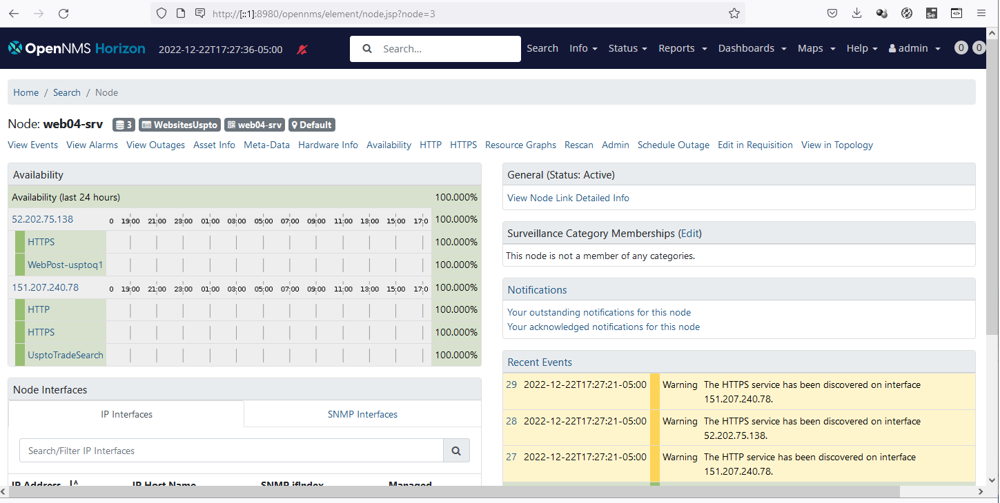
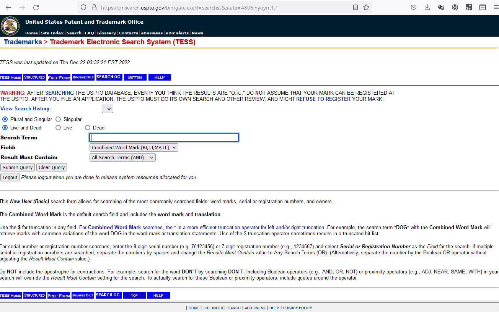
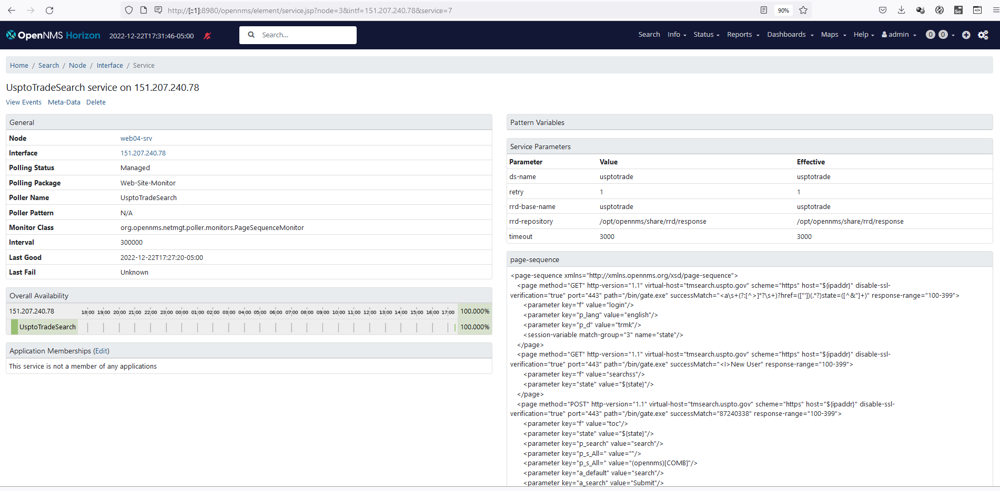
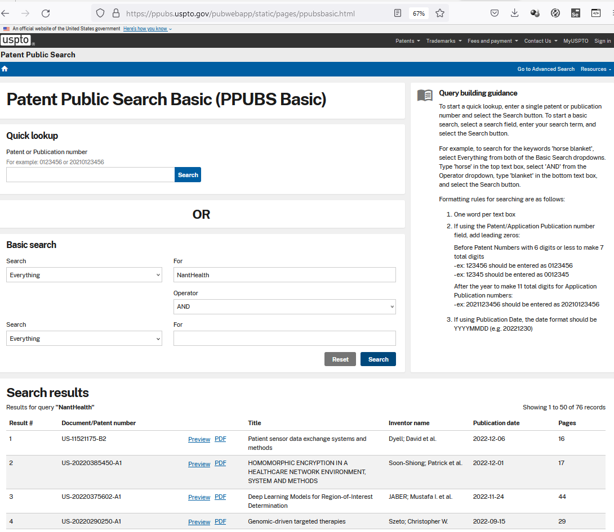
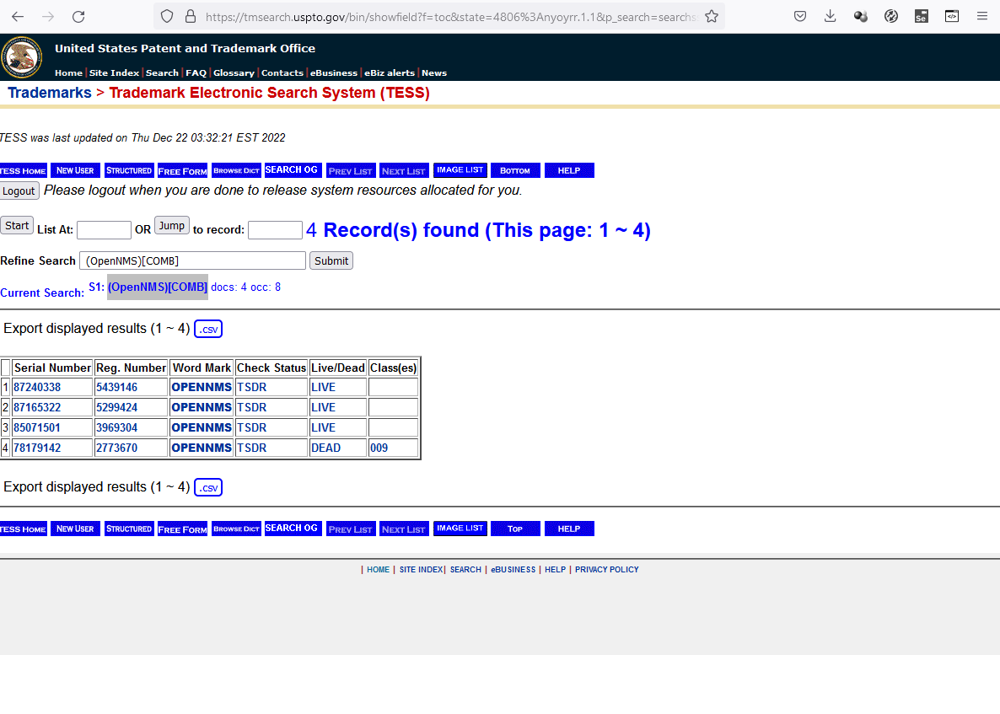
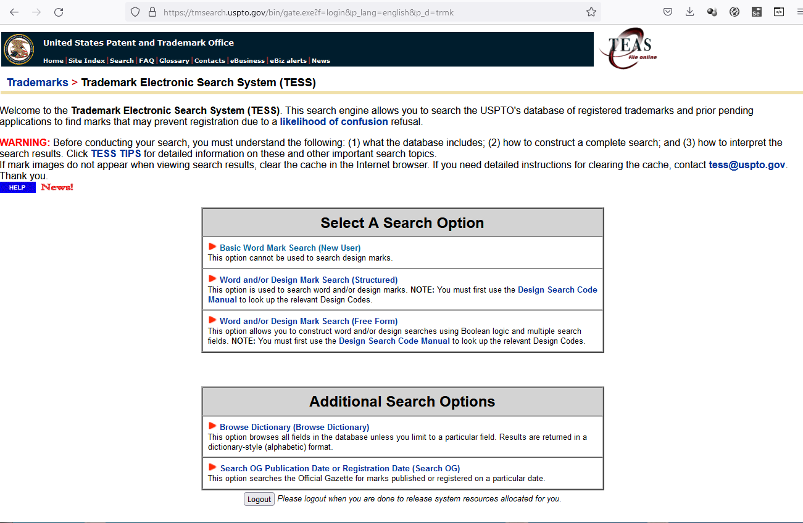
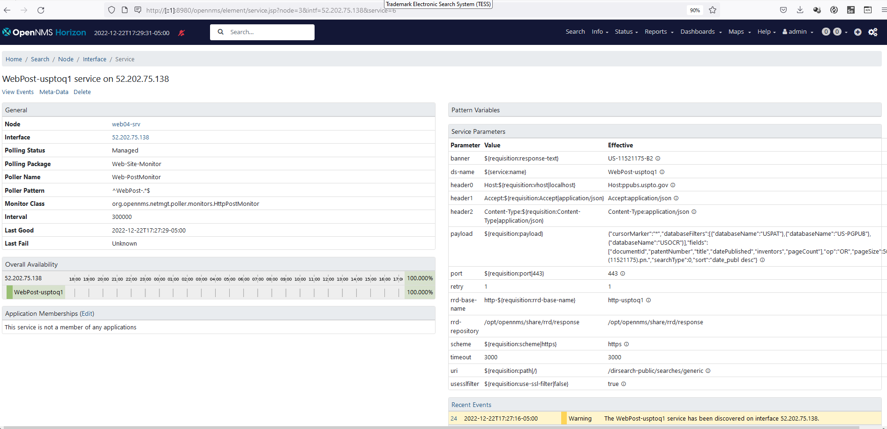

## Web Site Monitoring example

This folder contains several examples of web site monitoring using opennms metadata, the WebMonitor and the pageSequenceMonitor.
The use of metadata is basedon notes in discourse https://opennms.discourse.group/t/how-to-monitor-websites-using-metadata/1227
but some corrections have been made
















## USPTO monitoring using HttpPostMonitor

### OpenNMS service


### description
The usa patent search page is shown here  https://ppubs.uspto.gov/pubwebapp/static/pages/ppubsbasic.html


This uses javascript to create a json based search 
POST https://ppubs.uspto.gov/dirsearch-public/searches/generic

Request body:

```
{
	"cursorMarker": "*",
	"databaseFilters": [
		{
			"databaseName": "USPAT"
		},
		{
			"databaseName": "US-PGPUB"
		},
		{
			"databaseName": "USOCR"
		}
	],
	"fields": [
		"documentId",
		"patentNumber",
		"title",
		"datePublished",
		"inventors",
		"pageCount"
	],
	"op": "OR",
	"pageSize": 50,
	"q": "(11521175).pn.",
	"searchType": 0,
	"sort": "date_publ desc"
}

```

The response to this search is 

```
{
	"cursorMarker": "AoJwgO6u8oQDPDEwMDAwMDY3MjgzOTYhVVMtVVMtMTE1MjExNzU=",
	"numFound": 1,
	"docs": [
		{
			"documentId": "US-11521175-B2",
			"datePublished": "2022-12-06",
			"title": "Patient sensor data exchange systems and methods",
			"patentNumber": "11521175",
			"inventors": "Dyell; David et al.",
			"pageCount": 16
		}
	]
}

```

In the OpenNMS test we use the PostMonitor to send a json search string with a request for a NantHealth patent and receive back the patent refernces

### configuration

in poller-configuration.xml

```
     <service name="Web-PostMonitor" interval="300000" user-defined="false" status="on">
         <pattern><![CDATA[^WebPost-.*$]]></pattern> 
         <parameter key="retry" value="1" />
         <parameter key="timeout" value="3000" />
         <parameter key="port" value="${requisition:port|443}" />
         <parameter key="scheme" value="${requisition:scheme|https}" />  
         <parameter key="ds-name" value="${service:name}" /> 
         <parameter key="rrd-repository" value="/opt/opennms/share/rrd/response"/>
         <parameter key="rrd-base-name" value="http-${requisition:rrd-base-name}" /> 
         <parameter key="uri" value="${requisition:path|/}" /> 
         <!-- response regex -->
         <parameter key="banner" value="${requisition:response-text}"/>
         <parameter key="payload" value="${requisition:payload}"/>
         <!-- header must have a value if used -->
         <parameter key="header0" value="Host:${requisition:vhost|localhost}"/>
         <parameter key="header1" value="Accept:${requisition:Accept|application/json}"/>
         <parameter key="header2" value="Content-Type:${requisition:Content-Type|application/json}"/>
         <parameter key="usesslfilter" value="${requisition:use-ssl-filter|false}" /> 
      </service>
      
     <monitor service="Web-PostMonitor" class-name="org.opennms.netmgt.poller.monitors.HttpPostMonitor"/>
       
```

in the WebsitesUspto  requisition WebPost-usptoq1 matches against the Web-PostMonitor definition above

```
<?xml version="1.0" encoding="UTF-8"?>
<model-import xmlns="http://xmlns.opennms.org/xsd/config/model-import" date-stamp="2022-12-16T06:43:49.732-05:00" foreign-source="WebsitesUspto"
   last-import="2022-12-16T06:44:44.866-05:00">
 
 <node foreign-id="web04-srv" node-label="web04-srv">
      <interface ip-addr="52.202.75.138" status="1" snmp-primary="N">
         <monitored-service service-name="WebPost-usptoq1">
            <meta-data context="requisition" key="vhost" value="ppubs.uspto.gov" />
            <meta-data context="requisition" key="path" value="/dirsearch-public/searches/generic" />
            <meta-data context="requisition" key="rrd-base-name" value="usptoq1" />
            <meta-data context="requisition" key="response" value="100-399" />
            <meta-data context="requisition" key="scheme" value="https" />
            <meta-data context="requisition" key="use-ssl-filter" value="true" />
            <meta-data context="requisition" key="port" value="443" />
            <meta-data context="requisition" key="response-text" value="US-11521175-B2" />
            <meta-data context="requisition" key="payload" value="{&quot;cursorMarker&quot;:&quot;*&quot;,&quot;databaseFilters&quot;:[{&quot;databaseName&quot;:&quot;USPAT&quot;},{&quot;databaseName&quot;:&quot;US-PGPUB&quot;},{&quot;databaseName&quot;:&quot;USOCR&quot;}],&quot;fields&quot;:[&quot;documentId&quot;,&quot;patentNumber&quot;,&quot;title&quot;,&quot;datePublished&quot;,&quot;inventors&quot;,&quot;pageCount&quot;],&quot;op&quot;:&quot;OR&quot;,&quot;pageSize&quot;:50,&quot;q&quot;:&quot;(11521175).pn.&quot;,&quot;searchType&quot;:0,&quot;sort&quot;:&quot;date_publ desc&quot;}" />
            <meta-data context="requisition" key="Accept" value="application/json"/>
            <meta-data context="requisition" key="Content-Type" value="application/json"/>
         </monitored-service>
<!--          <monitored-service service-name="ICMP" /> -->
<!--     <monitored-service service-name="HTTPS" /> -->
      </interface>
      
      <!-- only ipv6 reponse to ping 151.207.240.78 -->
      <interface ip-addr="151.207.240.78" status="1" snmp-primary="N">
         <monitored-service service-name="UsptoTradeSearch">
         </monitored-service>
      </interface>
</node>


</model-import>

```


## USPTO monitoring using PageSequenceMonitor

### OpenNMS service


### description
